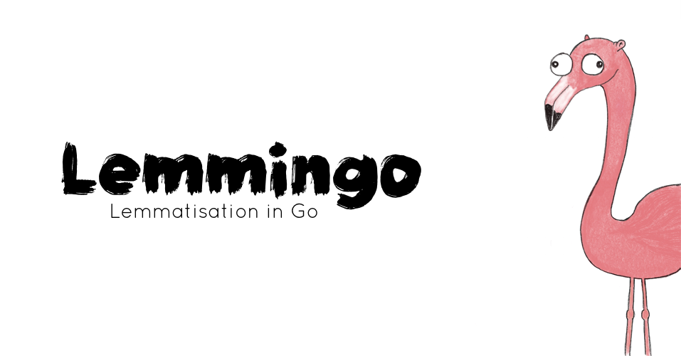

# 🐹🦩 Lemmingo

<p align="right">
  
</p>

> Defensive lemmatiser/stemmer written in Go ⊂( ⚆ ϖ⚆)っ
>
> [](https://goreportcard.com/report/github.com/smileart/lemmingo) [](https://godoc.org/github.com/smileart/lemmingo)


## 🤔 Why

There are lots of NLP solutions written in Python. There are some written in Go: [jargon](https://github.com/clipperhouse/jargon) which is great for tokenisation, canonical terms and lemmas for something like StackOverflow tagging purposes. There’s excellent [golem](https://github.com/aaaton/golem) which comes with a bunch of compressed lemmatisation dictionaries out of the box. There’s magnificent [prose](https://github.com/jdkato/prose) which works as a Swiss army knife of Go text processing, including tokenisation, part-of-speech tagging, and named-entity extraction. But, there also some gaps which this project focuses on:

1. Using PoS to resolve disambiguations in lemmatisation process, e.g. “stranger” as a singular noun (lemma: “stranger”) or as a comparative adjective (lemma: "strange").
1. Using stemming as an optional fallback when the lemmatiser dictionary lacks some vocabulary, e.g. imagine there’s no word “bubbling” in the dictionary (as in “A bubbling pot of soup was steaming on the range.”) What should we do in that case?
1. Using spell checking as an optional fallback for stemming issues, e.g. “bubbling” (if it wasn‘t in the dictionary) turned into “bubbl”, which you can easily fix back into “bubble” (and preserve understangind that it‘s a verb as in “to bubble”)
1. Using your own arbitrary dictionaries in plain text format which are easy to create, analyse, maintain, extend, handle with simplest `grep`, `awk`, `sed` commands or edit in any code editor or spreadsheet apps.
1. Dealing with various tagsets from different treebanks / corpuses and/or libraries / services. Mapping is as trivial as adding another Map to tagsets data file, and turning original tags into [Universal Tagset]() ones.

## 📦 Installing

To install Lemmingo just put it into your go.mod file or do:

```shell
go get github.com/smileart/lemmingo
```

If you're going to use "defensive" fallbacks you'd need to install some dependencies:

```shell
# Aspell lib
sudo apt-get install aspell libaspell-dev

# And dictionaries for your target languages
sudo apt-get install aspell-ua aspell-se

# On macOS it'd be
brew install aspell

# To check the dicts list and codes
aspell dump dicts
```

## 🛠 Usage

```go
package main

import (
	"fmt"
	"path/filepath"

	"github.com/smileart/lemmingo"
)

func main() {
	var (
		l string
		ok bool
		err error
	)

	dictAbsPath, err := filepath.Abs("./dicts/en.lmm")
	if err != nil {
		panic(err)
	}

	lem, err := lemmingo.New(dictAbsPath, "", "", false, false, false)
	if err != nil {
		panic(err)
	}

	l, ok, err = lem.Lemma("i'dn't've", "PRP+MD+RB+VBP")
	fmt.Println(l, ok, err)

	l, ok, err = lem.Lemma("stranger", "NN")
	fmt.Println(l, ok, err)

	l, ok, err = lem.Lemma("stranger", "JJR")
	fmt.Println(l, ok, err)

	l, ok, err = lem.Lemma("quadrillion", "NN")
	fmt.Println(l, ok, err)

	// Output:
	// i+would+not+have true <nil>
	// stranger true <nil>
	// strange true <nil>
	// quadrillion false Word's (quadrillion) lemma wasn't found!
}
```

For much more usage examples and quirks see [./examples](./examples)

## ✨ Features

* Basic usage is trivial:
    ```go
	lem, err := lemmingo.New(dictionaryPath, "", "", false, false, false)
	l, ok, e := lem.Lemma("word", "POS")
	// => <word>, true, <nil>    # in case of lookup success
	// => <word>, false, <error> # in case of lookup failure
    ```
  In this case you'd use your specified dictionary (for format reference see: [en.lmm](./dicts/en.lmm)) to look for the lemma or get an error if one wasn't found.

* Default dictionary(-ies):
    ```go
	lem, err := lemmingo.New("./en.lmm", "", "", false, false, false)
	l, ok, e := lem.Lemma("word", "POS")
	// => <word>, true, <nil>    # in case of lookup success
	// => <word>, false, <error> # in case of lookup failure
    ```
  On first usage Lemmingo is going to install default dictionaries (currently English only) to `$HOME/.lemmingo` so when you use relative dictionary pass instead of absolute that's the place where it's going to look for a file. alos you can put your custom files in the same directory to use them with relative path.

* Additionally you could provide a language (for reference see [Go Docs](https://godoc.org/golang.org/x/text/language) and [BCP 47](https://tools.ietf.org/html/bcp47)) and a flag to enable Snowball Stemmer fallback:
    ```go
	lem, err := lemmingo.New(dictionaryPath, "en-GB", "", true, false, false)
	l, ok, e := lem.Lemma("word", "POS")
	// => <stemma>, true, <nil> # in any case, cause stemmer would algorithmically find a stemma in nay case
    ```
  In this case after failing to find a word in the dictionary provided, Lemmingo will pass the word to Snowball stemmer and return its result. **WARNING**: see [Caveats](##Caveats) for possible issues.

* Additionally you could provide the second flag to enable Aspell Spell Checker fallback:
    ```go
	lem, err := lemmingo.New(dictionaryPath, "en-GB", "", true, false, false)
	l, ok, e := lem.Lemma("word", "POS")
	// => <stemma after spell checking>, true, <nil> # in any case, cause stemmer/spell checker would algorithmically find a stemma in nay case and replace it with a correction if there was one
    ```
  In this case after failing to find a word in the dictionary provided, Lemmingo will pass the word to Snowball stemmer and then pass the result to the Aspell Spell Checker. **WARNING**: see [Caveats](##Caveats) for possible issues.

* When the third argument provided on Lemmingo creation, the tagset mapping is going to be applied to the dictionary on loading. The original dictionary tagset will be turned into [A Universal Part-of-Speech Tagset](https://arxiv.org/abs/1104.2086) so the consequent lemmas searches should use it as well on requesting the lemmatiser:
    ```go
	lem, err := lemmingo.New(dictionaryPath, "en-GB", "penn", true, false)
	l, ok, e := lem.Lemma("word", "UNIVERSAL POS", false)
	// => <stemma>, true, <nil> # in any case, cause stemmer would algorithmically find a stemma in nay case
    ```

* Stemming could be used independently from lemmatisation like this:
    ```go
	lem, err := lemmingo.New(dictionaryPath, "en-GB", "", true, false, false)
	s, e := lem.Stem("word", false)
	// => <stemm>, <nil>
    ```

* There's no way to use spell checking independently from stemming, but if you turned stemmer off, but provided speller flag the lemmatizer will be correcting incoming words instead of stemmer results, which could be useful if you have a text with typos and still want to look for lemmas in the dictionary:
    ```go
	lem, err := lemmingo.New(dictionaryPath, "en-GB", "", false, true, false)
	l, ok, e := lem.Lemma("wword", "POS")
	// => <lemma>, true, <nil>
    ```

* Tagset mapping could be used independently from lemmatizer and in case you have let's say PoS tags from Penn Treebank Project (same for NLTK) you can do the following:
    ```go
	import (
		"github.com/smileart/lemmingo"
		"github.com/smileart/lemmingo/tagset"
	)

	// ...

	lem, err := lemmingo.New(dictionaryPath, "en-GB", "freeling", true, true, false)
	mapPos := tagset.MapPos("penn", "en-GB")

	pos, _ := mapPos(token.Tag)
	l, ok, e := lem.Lemma("word", pos)
	// => <lemma>, true, <nil>
    ```

* When using concurrently pass the `concurrent` flag to `New`/`Build` methods:
    ```go
	lem, err := lemmingo.New(dictionaryPath, "en-GB", "freeling", true, true, true)
	lem, err := Build(dictionaryPath, true, "english", true, "en_US", "freeling", "en-US", true)
    ```

## ⚠️ Caveats

* The project is in early stages of development, so use it in production at your own risk.
* Currently the only dictionary shipped with the library is an English dictionary from [FreeLing Project](http://nlp.lsi.upc.edu/freeling/). If you're interested in supporting more languages, feel free to use your own dictionary with absolute path to the file, or put one to `$HOME/.lemmingo` to use relative path. Additionally, feel free to contact author and/or create PR to add more languages to standard shipping.
* Currently the two tagsets provided out of the box are FreeLing tagset for English language, and Penn Treebank Project tagset with slight modifications. If you are interested in more mappings, feel free to contribute to the project or contact author for discussion.
* Lookups are as good as your tokeniser PoS tagging. Consider the following example: if you requested a word "apple" with PoS "VERB" lemmatiser alone won't find it in the dictionary!
* Since stemmers work algorithmically, results could and often will be unsatisfactory or unpredictable, so when using Lemmingo with stemming enabled, be aware of possible issues. Example: if the word "laboratory" wasn't found in the dictionary (with a certain PoS provided), Snowball stemmer would turn it into "laboratori".
* Since spell checker chooses the first suggestion for the misspelled words automatically, there could and often will be issues with the results, for example: if word "teenager" wasn't in the dictionary and you'd enabled stemmer and spell checker fallbacks, the stemmer's result would be "teenag" and after spell checker's correction the result would be "teenage".
* Lemmingo will do its best to turn your BCP 47 language tag into a valid language option for Aspell and Snowball respectively, but since these libraries do NOT support all the possible languages and use different standards for naming them, there might be issues related to language tag conversion, spelling dictionaries absence and so on. Think about using `Build` method directly with specific languages.
* Since Snowball/Aspell bindings have thread-safety [issues](https://github.com/tebeka/snowball/issues/3), there's an additional flag argument exposed in `New` and `Build` methods respectively, so if you use Lemmingo in goroutines do pass `concurrent` = `true` to create a stemmer/speller per goroutine not per Lemmingo instance.
* Since Aspell uses dictionaries every instance consumes one file descriptor from the system limit per process, so unlike stemmer the speller is created cautiously with limit equal to `runtime.NumCPU()` otherwise on handling huge texts concurrently it'd consume all the descriptors allowed.
* Currently the underlying Aspell binding has **[issues with CGO error handling](https://github.com/trustmaster/go-aspell/issues/1)** when unknown language provided, so when using `New`/`Build` methods make sure you've tested it with all the languages you're planning to support.
* For development convenience you just run your code using Lemmingo and the default dictionary will be automatically installed into `$HOME/.lemmingo` directory, **BUT** when shipping resulting binaries/build/container **DO NOT FORGET** to provide dictionaries and allow setting absolute path to them.
* Try to use the latest version of Aspell library and its dictionaries. Example:
    ```shell
      # macOS 10.15.4
      brew install aspell
      aspell -v
      # => International Ispell Version 3.1.20 (but really Aspell 0.60.8)
      # Input: biologically (not in the dictionary) -> Stemma: biolog (https://snowballstem.org/demo.html) -> Spelling: biology

      # Ubuntu 18.04, bionic
      apt install aspell
      aspell -v
      # => International Ispell Version 3.1.20 (but really Aspell 0.60.7-20110707)
      # Input: biologically (not in the dictionary) -> Stemma: biolog (https://snowballstem.org/demo.html) -> Spelling: bio log

      # Ubuntu 20.04, focal
      apt install aspell
      aspell -v
      # => International Ispell Version 3.1.20 (but really Aspell 0.60.8)
      # Input: biologically (not in the dictionary) -> Stemma: biolog (https://snowballstem.org/demo.html) -> Spelling: biology
    ```

## 💡 Tips & Tricks

* When handling huge texts it might be a good idea to put some [cache](https://github.com/patrickmn/go-cache) in front of `Lemma` calls, which on our test data with more than half a million words of natural text took ~6 seconds to warm up with about 200-400ms for consequent processing.
* This library is tested to be a great addition to [jdkato/prose](https://github.com/jdkato/prose) tokenisation. Use Lemmingo with `penn`/`en` tagset (Penn Treebank Project) to lemmatise prose's tokens.

## 🗃 Credits & Licensing

> This project is distributed under [MIT License](https://tldrlegal.com/license/mit-license) see full text in [LICENSE](./LICENSE) file.
> © Serge Bedzhyk <smileart21@gmail.com>

> English dictionary data was obtained from [FreeLing Project](http://nlp.lsi.upc.edu/freeling/) which is distributed under [AGPL License](https://tldrlegal.com/license/gnu-affero-general-public-license-v3-(agpl-3.0)) and consequently modified with small additional manual and automated editing using various publicly available sources. See full license text in [./LICENSES/AGPL](./LICENSES/AGPL3)
> © Lluís Padró + [contributors](http://nlp.lsi.upc.edu/freeling/node/5) + TALP Research Center, in Universitat Politècnica de Catalunya.

> "[A Universal Part-of-Speech Tagset](https://github.com/slavpetrov/universal-pos-tags)" is distributed under (Apache-2.0 License)[https://tldrlegal.com/license/apache-license-2.0-(apache-2.0)] full text and NOTICE file weren't provided by authors but full template license text could be found in [./LICENSES/APACHE](./LICENSES/APACHE)
> © Slav Petrov, Dipanjan Das and Ryan McDonald

> [go-aspell](https://github.com/trustmaster/go-aspell) is distributed with the license which could be read in full in [./LICENSES/GOASPELL](./LICENSES/GOASPELL)
> © Vladimir Sibirov + [Aspell](http://aspell.net/) © Kevin Atkinson <kevina@gnu.org>

> [snowball](https://github.com/tebeka/snowball) is distributed under [MIT License](https://tldrlegal.com/license/mit-license) see full text in [LICENSE](./LICENSES/SNOWBALL) file.
> Copyright (c) 2012, Miki Tebeka <miki.tebeka@gmail.com>

> Special thanks to [Anton Södergren](https://github.com/aaaton/) for inspiration and helpful answers, and [Anton Ilin](https://github.com/bronislav) for discussions, opinion, testing and rubber-duck debugging :)
